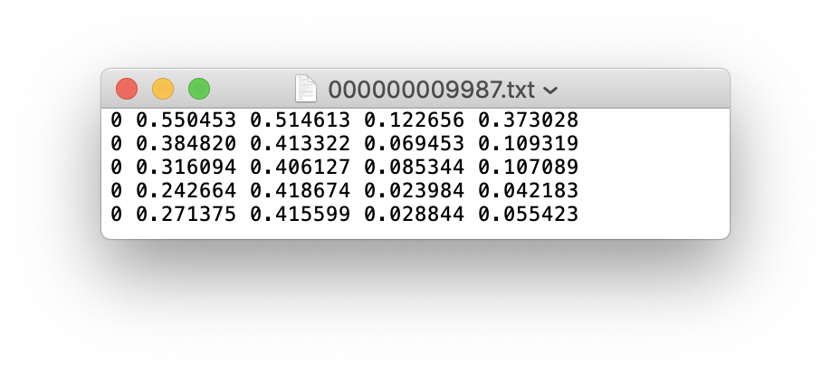
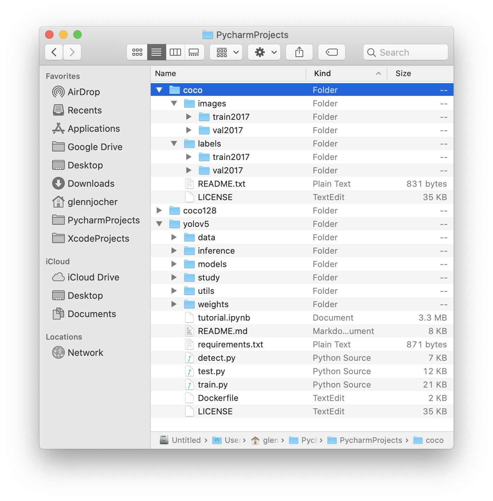
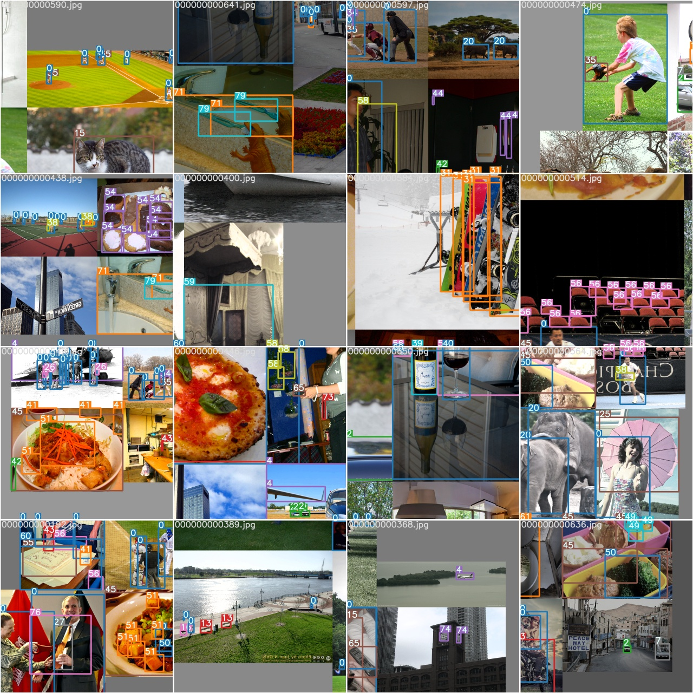
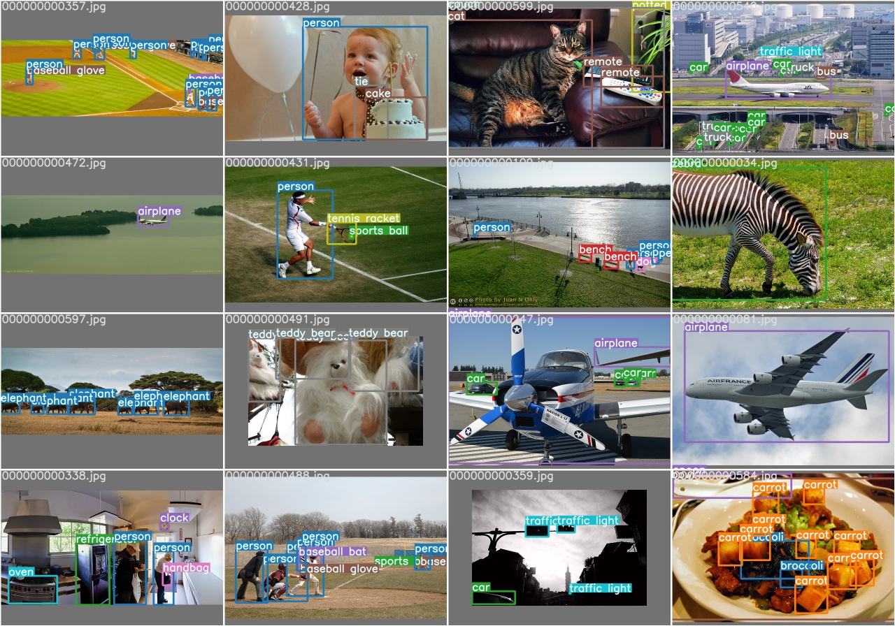
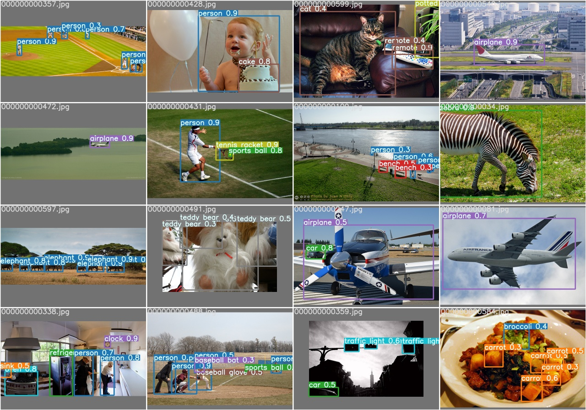
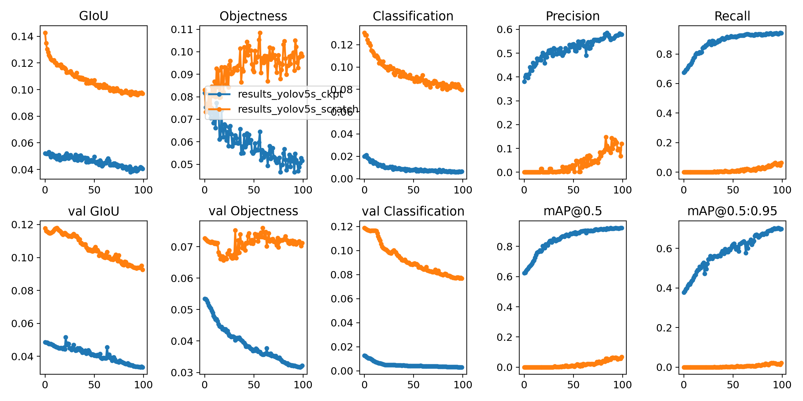

This guide explains how to train your own **custom dataset** with YOLOv5.

## Before You Start

Clone this repo, download tutorial dataset, and install [requirements.txt](https://github.com/ultralytics/yolov5/blob/master/requirements.txt) dependencies, including **Python>=3.7** and **PyTorch>=1.5**.

```bash
git clone https://github.com/ultralytics/yolov5 # clone repo
python3 -c "from yolov5.utils.google_utils import gdrive_download; gdrive_download('1n_oKgR81BJtqk75b00eAjdv03qVCQn2f','coco128.zip')" # download dataset
cd yolov5
pip install -U -r requirements.txt
```

## Train On Custom Data

### 1. Create Dataset.yaml

[data/coco128.yaml](https://github.com/ultralytics/yolov5/blob/master/data/coco128.yaml) is a small tutorial dataset composed of the first 128 images in [COCO](http://cocodataset.org/#home) train2017. These same 128 images are used for both training and validation in this example. `coco128.yaml` defines 1) a path to a directory of training images (or path to a *.txt file with a list of training images), 2) the same for our validation images, 3) the number of classes, 4) a list of class names:
```yaml
# train and val datasets (image directory or *.txt file with image paths)
train: ../coco128/images/train2017/
val: ../coco128/images/train2017/

# number of classes
nc: 80

# class names
names: ['person', 'bicycle', 'car', 'motorcycle', 'airplane', 'bus', 'train', 'truck', 'boat', 'traffic light',
        'fire hydrant', 'stop sign', 'parking meter', 'bench', 'bird', 'cat', 'dog', 'horse', 'sheep', 'cow',
        'elephant', 'bear', 'zebra', 'giraffe', 'backpack', 'umbrella', 'handbag', 'tie', 'suitcase', 'frisbee',
        'skis', 'snowboard', 'sports ball', 'kite', 'baseball bat', 'baseball glove', 'skateboard', 'surfboard',
        'tennis racket', 'bottle', 'wine glass', 'cup', 'fork', 'knife', 'spoon', 'bowl', 'banana', 'apple',
        'sandwich', 'orange', 'broccoli', 'carrot', 'hot dog', 'pizza', 'donut', 'cake', 'chair', 'couch',
        'potted plant', 'bed', 'dining table', 'toilet', 'tv', 'laptop', 'mouse', 'remote', 'keyboard', 
        'cell phone', 'microwave', 'oven', 'toaster', 'sink', 'refrigerator', 'book', 'clock', 'vase', 'scissors', 
        'teddy bear', 'hair drier', 'toothbrush']
```


### 2. Create Labels

After using a tool like [Labelbox](https://labelbox.com/) or [CVAT](https://github.com/opencv/cvat) to label your images, export your labels to **darknet format**, with one `*.txt` file per image (if no objects in image, no `*.txt` file is required). The `*.txt` file specifications are:

- One row per object
- Each row is `class x_center y_center width height` format.
- Box coordinates must be in **normalized xywh** format (from 0 - 1). If your boxes are in pixels, divide `x_center` and `width` by image width, and `y_center` and `height` by image height.
- Class numbers are zero-indexed (start from 0).

Each image's label file should be locatable by simply replacing `/images/*.jpg` with `/labels/*.txt` in its pathname. An example image and label pair would be:
```bash
dataset/images/train2017/000000109622.jpg  # image
dataset/labels/train2017/000000109622.txt  # label
```
An example label file with 5 persons (all class `0`):  



### 3. Organize Directories

Organize your train and val images and labels according to the example below. Note `/coco128` should be **next to** the `/yolov5` directory. Make sure `coco128/labels` folder is next to `coco128/images` folder.



### 4. Select a Model

Select a model from the `./models` folder. Here we select [yolov5s.yaml](https://github.com/ultralytics/yolov5/blob/master/models/yolov5s.yaml), the smallest and fastest model available. See our README [table](https://github.com/ultralytics/yolov5#pretrained-checkpoints) for a full comparison of all models. Once you have selected a model, if you are not training COCO, **update** the `nc: 80` parameter in your yaml file to match the number of classes in your dataset from step **1.**
```yaml
# parameters
nc: 80  # number of classes   <------------------  UPDATE to match your dataset
depth_multiple: 0.33  # model depth multiple
width_multiple: 0.50  # layer channel multiple

# anchors
anchors:
  - [10,13, 16,30, 33,23]  # P3/8
  - [30,61, 62,45, 59,119]  # P4/16
  - [116,90, 156,198, 373,326]  # P5/32

# yolov5 backbone
backbone:
  # [from, number, module, args]
  [[-1, 1, Focus, [64, 3]],  # 1-P1/2
   [-1, 1, Conv, [128, 3, 2]],  # 2-P2/4
   [-1, 3, Bottleneck, [128]],
   [-1, 1, Conv, [256, 3, 2]],  # 4-P3/8
   [-1, 9, BottleneckCSP, [256, False]],
   [-1, 1, Conv, [512, 3, 2]],  # 6-P4/16
   [-1, 9, BottleneckCSP, [512, False]],
   [-1, 1, Conv, [1024, 3, 2]], # 8-P5/32
   [-1, 1, SPP, [1024, [5, 9, 13]]],
   [-1, 12, BottleneckCSP, [1024, False]],  # 10
  ]

# yolov5 head
head:
  [[-1, 1, nn.Conv2d, [na * (nc + 5), 1, 1, 0]],  # 12 (P5/32-large)

   [-2, 1, nn.Upsample, [None, 2, 'nearest']],
   [[-1, 6], 1, Concat, [1]],  # cat backbone P4
   [-1, 1, Conv, [512, 1, 1]],
   [-1, 3, BottleneckCSP, [512, False]],
   [-1, 1, nn.Conv2d, [na * (nc + 5), 1, 1, 0]],  # 16 (P4/16-medium)

   [-2, 1, nn.Upsample, [None, 2, 'nearest']],
   [[-1, 4], 1, Concat, [1]],  # cat backbone P3
   [-1, 1, Conv, [256, 1, 1]],
   [-1, 3, BottleneckCSP, [256, False]],
   [-1, 1, nn.Conv2d, [na * (nc + 5), 1, 1, 0]],  # 21 (P3/8-small)

   [[], 1, Detect, [nc, anchors]],  # Detect(P3, P4, P5)
  ]
```

### 5. Train

Run the training command below to train `coco128.yaml` for 5 epochs. You can train yolov5s from scratch by passing `--cfg yolov5s.yaml --weights ''`, or train from a pretrained checkpoint by passing a matching weights file: `--cfg yolov5s.yaml --weights yolov5s.pt`.
```bash
# Train yolov5s on coco128 for 5 epochs
$ python train.py --img 640 --batch 16 --epochs 5 --data ./data/coco128.yaml --cfg ./models/yolov5s.yaml --weights ''
```

For training command outputs and further details please see the training section of Google Colab Notebook. <a href="https://colab.research.google.com/github/ultralytics/yolov5/blob/master/tutorial.ipynb"></a>

### 6. Visualize

After training starts, view `train*.jpg` images to see training images, labels and augmentation effects. Note a mosaic dataloader is used for training (shown below), a new dataloading concept developed by Ultralytics and first featured in [YOLOv4](https://arxiv.org/abs/2004.10934). If your labels are not correct in these images then you have incorrectly labelled your data, and should revisit **2. Create Labels**.


After the first epoch is complete, view `test_batch0_gt.jpg` to see test batch 0 ground truth labels:


And view `test_batch0_pred.jpg` to see test batch 0 predictions:


Training losses and performance metrics are saved to Tensorboard and also to a `results.txt` logfile. `results.txt` is plotted as `results.png` after training completes. Partially completed `results.txt` files can be plotted with `from utils.utils import plot_results; plot_results()`. Here we show yolov5s trained on coco128 to 100 epochs, starting from scratch (orange), and starting from pretrained `yolov5s.pt` weights (blue):




## Reproduce Our Environment

To access an up-to-date working environment (with all dependencies including CUDA/CUDNN, Python and PyTorch preinstalled), consider a:

- **GCP** Deep Learning VM with $300 free credit offer. See our [GCP Quickstart Guide](https://github.com/ultralytics/yolov5/wiki/GCP-Quickstart) 
- **Google Colab Notebook** with 12 hours of free GPU time. <a href="https://colab.research.google.com/github/ultralytics/yolov5/blob/master/tutorial.ipynb"></a>
- **Docker Image** https://hub.docker.com/r/ultralytics/yolov5. See [Docker Quickstart Guide](https://github.com/ultralytics/yolov5/wiki/Docker-Quickstart) 